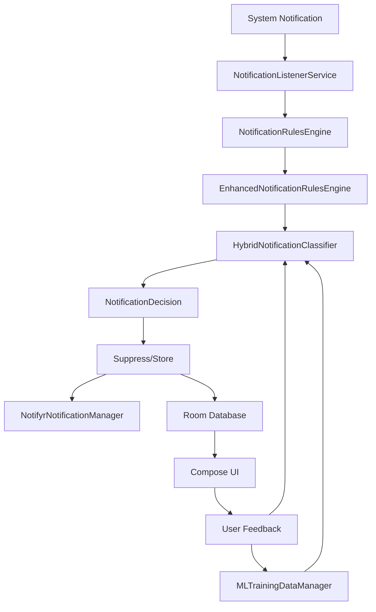

## Notifyr Architecture Overview

This document explains how Notifyr is structured internally: the major layers, key components, and how a notification flows through the system from arrival to display (or suppression).

If you are a developer new to the project, read this first, then refer to:
- `.github/copilot-instructions.md` for detailed coding patterns and conventions
- `docs/ML_SYSTEM.md` for the hybrid classifier internals
- `docs/IMPLEMENTATION_SUMMARY.md` for the enhanced features summary

---

## High‑Level Architecture

Notifyr follows **Clean Architecture with MVVM**, split into:

- **Presentation/UI layer** – Jetpack Compose screens and ViewModels (`ui/`)
- **Domain layer** – Core models, rules engines, ML components, and use cases (`domain/`)
- **Data layer** – Room database, DataStore, repositories (`data/`)
- **Service layer** – Android services for notification interception and background work (`service/`)
- **Dependency injection** – Hilt modules wiring everything together (`di/`)

### Module & Package Layout (Conceptual)

```text
app/
  src/main/java/com/javohirmx/notifyr/
    di/            # Hilt modules
    data/          # Room entities, DAOs, repositories, DataStore access
    domain/        # Models, rules engines, ML classifier, use cases
    ui/            # Jetpack Compose screens + ViewModels
    service/       # NotificationListenerService, screen time, export/import
```

The **core loop** of the app is:
1. Intercept a system notification
2. Classify and tag it (rules + ML)
3. Decide whether to suppress or show
4. Persist it in the database
5. Use it for history, digests, and insights

---

## Notification Flow

The diagram below illustrates the end‑to‑end flow:



**Step‑by‑step:**

1. **Intercept**
   - `NotificationListenerService` receives notifications from the system.
   - Extracts fields such as package name, title, text, timestamp, category, sender, conversation ID, etc.

2. **Base classification (rules engine)**
   - `NotificationRulesEngine` evaluates:
     - Temporary app status (e.g., “show all from this app for 1 hour”)
     - App rules (always show / keyword filter / always ignore)
     - Keyword rules (default + user‑defined, with regex support)
     - Default app categories (e.g., banking vs social)
   - Produces an initial `NotificationImportance`: `URGENT`, `NORMAL`, or `IGNORE`.

3. **Enhanced tagging**
   - `EnhancedNotificationRulesEngine` assigns **tags**:
     - Priority
     - Contexts (work, personal, financial, social, etc.)
     - Time sensitivity
     - Action type
   - Tags do not override importance; they enrich it.

4. **Hybrid ML classification**
   - `HybridNotificationClassifier` combines:
     - The rules‑based importance
     - The ML classifier’s predicted importance and confidence
   - If the ML model is enabled and confident (above a configured threshold), ML may override the rules; otherwise, rules are trusted.

5. **Decision & suppression**
   - Based on final importance, tags, and **current focus mode**:
     - Urgent + allowed → cancel original, show enhanced custom notification
     - Normal → cancel original, add to digest
     - Ignore → cancel original and archive silently
   - Ongoing notifications (music, calls, media) are preserved to avoid breaking normal app behavior.

6. **Persistence**
   - The resulting `NotificationData` with tags, sender, conversation ID, etc. is stored in the Room database via `NotificationRepository`.

7. **UI & digests**
   - UI screens (`History`, `Dashboard`, `Digest`) subscribe to repository flows and display current state.
   - `SmartDigestScheduler` and `DigestGenerator` use stored notifications, tags, and focus modes to generate context‑aware digests.

8. **Feedback & learning**
   - User actions (marking a notification as misclassified, changing rules, toggling ML settings) feed back into:
     - The rules configuration
     - ML training data and model weights

---

## Layers in Detail

### Presentation Layer (`ui/`)

**Responsibilities:**
- Display notification history, digests, focus modes, rules, and settings
- Collect user input and forward it to ViewModels
- Reactively render state using Compose + StateFlow

**Key patterns:**
- Each major screen has:
  - A `*ViewModel` in `ui/.../` or `ui/.../viewmodel/`
  - A composable screen `*Screen.kt` that collects state and triggers events
- State is exposed via `StateFlow` from ViewModels and collected using `collectAsStateWithLifecycle()` in composables.

**Important screens (non‑exhaustive):**
- `DashboardScreen` – overview, recent urgent items, status widgets
- `HistoryScreen` – full log with filters and search
- `SettingsScreen` – central hub for rules, keywords, ML, focus modes, digests
- `FocusModeScreen`, `DigestSettingsScreen` – smart features configuration
- `MLSettingsScreen` – enable/disable ML, view stats, reset model

Navigation is implemented as a Compose navigation graph with a bottom navigation bar and nested routes.

---

### Domain Layer (`domain/`)

The domain layer encodes business logic and concepts, independent of Android UI.

**Core models:**
- `NotificationData` – domain representation of a notification (fields, importance, tags, sender, conversation ID)
- `NotificationTags` – multi‑dimensional tags (priority, context, time sensitivity, action type)
- `AppRule`, `KeywordRule`, `FocusMode`, `DigestSettings`, etc.

**Rules & classification:**
- `NotificationRulesEngine`
  - Evaluates temporary app rules, app rules, keyword rules, and default behaviors.
  - Produces `NotificationImportance`.
- `EnhancedNotificationRulesEngine`
  - Computes tags based on app category, content, and metadata.
  - Works in tandem with importance but does not override it.

**ML components:**
- `HybridNotificationClassifier` – orchestrates rules + ML prediction; defines how confidence thresholds are applied.
- `SmartNotificationClassifier` – ML model implementation (simple neural network) that outputs probability/score for urgency.
- `NotificationFeatureExtractor` – converts raw `NotificationData` and context into numeric features (e.g., hour of day, text length, caps ratio, presence of urgent keywords, app category flags, conversation activity).
- `MLTrainingDataManager` – stores and manages training samples, triggers batch training.

**Use cases & utilities:**
- Digest generation:
  - `DigestModels` / `EnhancedDigest` – structures for grouped and summarized notifications.
  - `DigestGenerator` – groups by conversation/app and produces a human‑readable summary.
  - `SmartDigestScheduler` – decides when to show digests (context‑aware unlock triggers, thresholds).
- Focus modes:
  - `FocusMode` model enums and configuration
  - `FocusModeManager` – determines the active mode (manual or auto‑switch based on time/day) and applies mode logic to classification decisions.
- Screen time & insights:
  - Domain models and use cases for aggregating screen time statistics and generating insights.

---

### Data Layer (`data/`)

The data layer provides persistence and configuration storage.

**Room database:**
- `NotificationEntity` – maps to notifications table, includes:
  - Basic fields (package, title, text, timestamp, importance)
  - `tagsJson` – serialized `NotificationTags`
  - `sender`, `conversationId` – for grouping
- `NotifyrDatabase` – Room database with migration logic (e.g., adding tags and conversation fields).
- DAOs for querying notifications by importance, tag filters, date, etc.

**Repositories:**
- `NotificationRepository`
  - Inserts, queries, and updates notifications
  - Provides Flow‑based streams for UI layers
  - Handles deduplication logic
- `AppRulesRepository`
  - Stores app rules in DataStore, exposes rule flows
- `KeywordRulesRepository`
  - Manages default and user‑defined keyword lists with regex support
- Settings & screen time repositories
  - Access DataStore and usage stats

**Configuration & settings:**
- App settings, focus mode config, digest settings, ML toggles, and training data are stored in **DataStore** rather than the database.
- DataStore is used for fast, transactional updates and reactive streams.

---

### Service Layer (`service/`)

Key Android services that run outside the UI:

- `NotificationListenerService`
  - Core interception and classification gateway
  - Orchestrates rules engines, ML classifier, focus mode checks, and suppression
  - Calls into repositories to persist notifications

- Screen time collector service
  - Uses `UsageStatsManager` to periodically collect app usage
  - Saves aggregate results for the Insights screen

- Data export/import service
  - Exports rules, keywords, and notifications as JSON
  - Imports and merges or replaces existing state

Some background work (such as digest scheduling and cleanup) is handled through **WorkManager** jobs coordinated with these services.

---

### Dependency Injection (`di/`)

Notifyr uses **Hilt** for dependency injection:

- `DatabaseModule` – provides Room database and DAOs
- `RepositoryModule` – binds repository interfaces to implementations
- `DataStoreModule` – configures DataStore instances for settings and rules
- `NotificationModule` – provides notification manager and channels
- `CoroutineModule` – application‑wide coroutine dispatchers
- `WorkManagerModule` – WorkManager configuration

All ViewModels, services, and use cases receive their dependencies via Hilt, keeping wiring centralized and testable.

---

## Focus Modes, Digests, and Tags – How They Interact

These three systems work together to define how and when notifications surface:

- **Tags** describe what a notification is
  - Example: `priority=IMPORTANT`, `contexts={WORK}`, `timeSensitivity=SOON`, `actionType=NEEDS_RESPONSE`

- **Focus mode** describes what the user cares about _right now_
  - Example: In **Work** mode, show WORK + CRITICAL, hide most SOCIAL
  - In **Sleep** mode, show only EMERGENCY or very high‑priority events

- **Digest** decides _when_ and _how_ to show non‑urgent items
  - Context‑aware triggers (unlock after 30 minutes, enough accumulated notifications, etc.)
  - Group by conversation and app, using tags to highlight what matters

Conceptually:

```text
Raw notification
  → Tags describe it (what, where, how urgent)
  → Focus mode gate (is this allowed to interrupt now?)
  → If allowed + urgent → show now
  → Else → archive silently or include in digest
```

---

## Related Documentation

- **User‑facing**
  - `docs/USER_GUIDE.md` – How to use Notifyr, configure modes, and understand digests
  - `docs/TROUBLESHOOTING.md` – Common issues and how to diagnose them

- **ML internals**
  - `docs/ML_SYSTEM.md` – Detailed description of the hybrid classifier, features, training loop, and model persistence

- **Implementation details**
  - `docs/IMPLEMENTATION_SUMMARY.md` – High‑level summary of enhanced features (suppression, tagging, digests, focus modes)
  - `.github/copilot-instructions.md` – In‑depth instructions for AI assistants and contributors

If you are making architectural changes, please keep this document in sync with the major concepts and flows.

